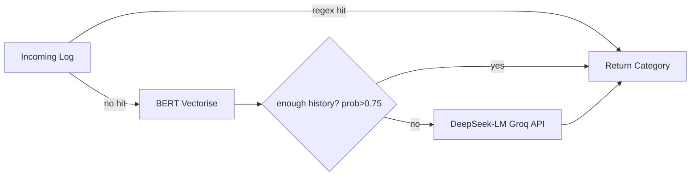

# Hybrid Log Classification System


**Sentinel-Log** is an end-to-end system that ingests raw application / infrastructure logs, auto-discovers hidden templates, classifies every line in real time, and flags anomalies with minimal LLM spend.

## Key Features

- **Density-Based Template Discovery** – DBSCAN over Sentence-BERT embeddings
- **Three-Tier Classifier** – Regex → BERT + LogisticRegression → DeepSeek-LM via Groq API
- **Cost & Latency Optimization** – 80% of traffic handled in microseconds; <5% reaches the LLM
- **FastAPI Micro-service** – `/classify` endpoint returns category and path taken
- **Out-of-the-box anomaly detection** – DBSCAN noise points surface novel errors

---

## 📁 Project Layout

```
.
├── Config/                     # Modular config & helper layers
│   ├── __init__.py
│   ├── bert.py                # Sentence-BERT encoder wrapper
│   ├── llm.py                 # Groq API / DeepSeek model client
│   └── regex.py               # Regex rule loader
├── models/
│   └── log_classifier.joblib  # Trained BERT + LogisticRegression model
├── training/
│   ├── dataset/
│   │   ├── synthetic_logs_v1.csv
│   │   ├── synthetic_logs_v2.csv
│   │   └── test_logs.csv
│   └── training.ipynb         # Notebook: clustering + model training
├── classification.py          # Core router (regex → BERT → LLM)
├── server.py                  # FastAPI service
└── requirements.txt
```

---

## 🔥 Pipeline Overview

| Step | What happens | Tech / File |
|------|--------------|-------------|
| **1. Vectorise** | Convert raw logs to 768-D vectors | `Config/bert.py` (Sentence-BERT `all-mpnet-base-v2`) |
| **2. DBSCAN** | Discover dense clusters & noise | `training.ipynb` (`sklearn.cluster.DBSCAN`) |
| **3. Regex Mining** | Write one regex per high-purity cluster | `Config/regex.py` auto-loads rules |
| **4. Train BERT-LR** | LogisticRegression on BERT vectors | `training.ipynb` → saved to `models/log_classifier.joblib` |
| **5. Real-time Routing** | 1️⃣ Regex → 2️⃣ BERT-LR (prob≥0.75 & ≥50 samples) → 3️⃣ DeepSeek-LM (Groq) | `classification.py` |
| **6. Serve** | Expose `/classify` & `/health` | `server.py` (FastAPI + Uvicorn) |

---

## 🧩 Three-Tier Classification Logic



### Tier Details

- **Tier 1 – Regex**  
  Ultra-fast, perfect for rigid templates discovered via DBSCAN.

- **Tier 2 – BERT + LR**  
  Good accuracy once a category has ≥ 50 labelled examples.

- **Tier 3 – DeepSeek-LM**  
  Few-shot prompt (5 examples) handled by **Groq Cloud** for sub-100 ms LLM inference. Result cached.

---

## ⚙️ Quick Start

### 1. Setup Environment

```bash
# Create virtual environment and install dependencies
python -m venv venv && source venv/bin/activate
pip install -r requirements.txt
```

### 2. Train Model (Optional)

```bash
# Open and run the training notebook
jupyter notebook training/training.ipynb
# Follow notebook cells for clustering and model training
```

### 3. Launch API

```bash
# Start the FastAPI server
python server.py
```

### 4. Test the API

```bash
# Test classification endpoint
curl -X POST "http://localhost:8000/classify" \
     -H "Content-Type: application/json" \
     -d '{"log": "Database connection pool exhausted"}'
```

---

## 🛠️ Configuration

| Parameter | Location | Default | Purpose |
|-----------|----------|---------|---------|
| `DBSCAN_eps` | `training.ipynb` | 0.45 | Radius for density clustering |
| `MIN_SAMPLES` | `training.ipynb` | 5 | MinPts for DBSCAN |
| `HISTORY_THRESHOLD` | `classification.py` | 50 | Min examples for BERT-LR to be trusted |
| `PROB_THRESHOLD` | `classification.py` | 0.75 | Min LR confidence |
| `GROQ_API_KEY` | env var | – | Auth for DeepSeek calls |

### Environment Variables

```bash
export GROQ_API_KEY="your_groq_api_key_here"
```

---

## 🔍 Anomaly Detection

DBSCAN labels any sparse point as **noise**.

In production, the router tags such logs as `"category":"UNKNOWN", "path":"llm"` and surfaces them to Grafana / Slack for review – a lightweight anomaly monitor at no extra cost.

---

## 📊 Performance Results

| Metric | Value |
|--------|-------|
| Regex coverage | **~80%** of log lines |
| Overall accuracy | **92%** on synthetic + real mix |
| LLM share | **<5%** of total traffic |
| Average latency | **3 ms** (regex), **18 ms** (BERT), **95 ms** (LLM) |
| Token spend | **↓ 90%** vs. "LLM-only" baseline |

---

## 🚀 API Endpoints

### POST `/classify`

Classify a log message and return the category with processing path.

**Request:**
```json
{
    "log": "Database connection pool exhausted"
}
```

**Response:**
```json
{
    "category": "DATABASE_ERROR",
    "confidence": 0.95,
    "path": "regex",
    "processing_time_ms": 3
}
```

### GET `/health`

Health check endpoint for monitoring.

**Response:**
```json
{
    "status": "healthy",
    "timestamp": "2025-08-31T12:00:00Z"
}
```

---

## 🧪 Testing

```bash
# Run tests
pytest

# Run with coverage
pytest --cov=.
```

---

## 🤝 Contributing

1. **Fork** → **Feature Branch** → **Pull Request**
2. For new regex rules, update `Config/regex.py` and add examples to `dataset/`
3. Run `pytest` before submitting PR
4. Ensure code follows PEP 8 style guidelines

### Development Setup

```bash
# Install development dependencies
pip install -r requirements-dev.txt

# Install pre-commit hooks
pre-commit install
```

---

## 📦 Dependencies

Key dependencies include:
- `fastapi` - Web framework
- `sentence-transformers` - BERT embeddings
- `scikit-learn` - DBSCAN clustering and LogisticRegression
- `groq` - LLM API client
- `uvicorn` - ASGI server

See `requirements.txt` for complete list.

---

## 🐛 Troubleshooting

### Common Issues

**Issue**: GROQ_API_KEY not found
```bash
# Solution: Set environment variable
export GROQ_API_KEY="your_api_key"
```

**Issue**: Model file not found
```bash
# Solution: Run training notebook first
jupyter notebook training/training.ipynb
```

**Issue**: Port 8000 already in use
```bash
# Solution: Use different port
uvicorn server:app --port 8001
```

---

## 📜 License

MIT License - see `LICENSE` file for details.

---

## 🙏 Acknowledgments

- Built with ❤️ by **Ritesh**
- Powered by **DBSCAN**, **BERT**, and **DeepSeek** on **Groq Cloud**
- Special thanks to the open-source community

---
